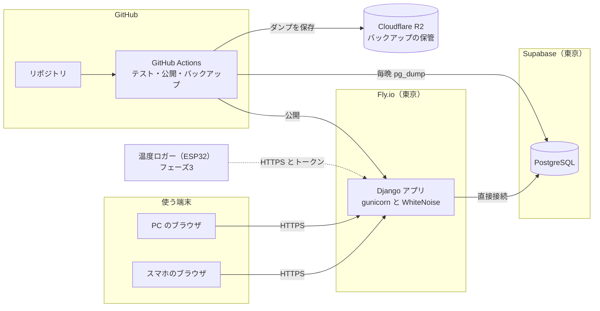
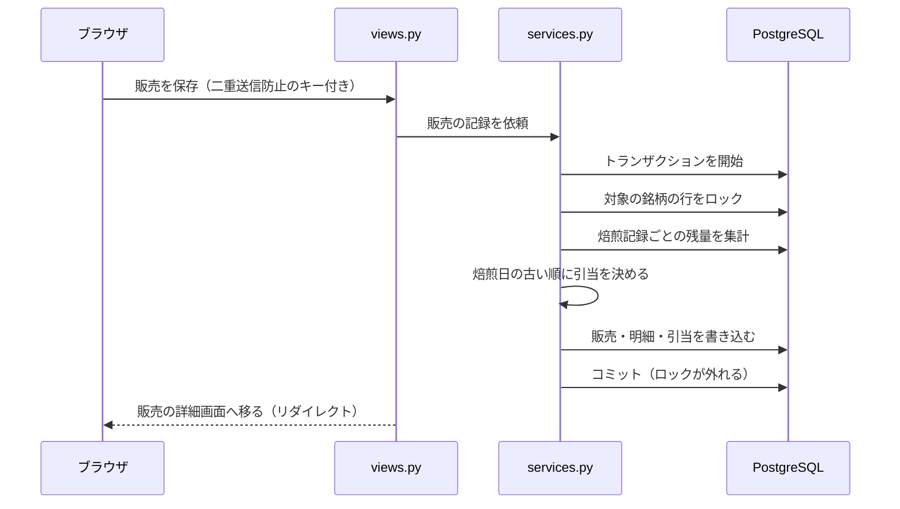
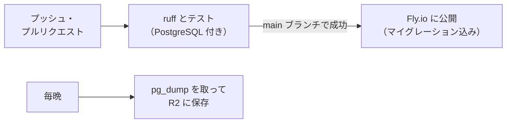
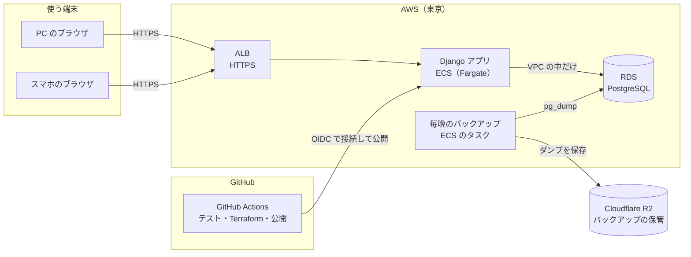

# コーヒー豆 在庫管理アプリ アーキテクチャ提案

- 版：v0.3
- 更新日：2026-09-17
- 対象：[仕様書](spec.md) v0.5
- 状態：データベースと公開先を決めた（「12. 決めたこと」）

## 1. 前提

| 項目 | 内容 | 仕様書 |
|---|---|---|
| 使う人 | 本人だけ | 1.2 |
| 使う場所 | 店や自宅に加えて、イベント会場など外出先からも使う。インターネット上で動かす | 1.2 |
| 端末 | PC とスマホのブラウザ。焙煎の記録は、焙煎の直後にスマホで入力する | 1.2・7 |
| データ量 | 少ない。生豆ロットは年に数十件、焙煎記録は年に数百〜千件 | 8 |
| 正確さ | 同時に保存しても、二重に送信しても、在庫の引当と原価の計算が食い違わない | 5・6・8 |
| バックアップ | 1日1回以上取り、アプリとは別の場所に保管する | 8 |
| サーバー | Python。フレームワークは Django | — |
| 将来 | フェーズ2で焙煎タイマーや CSV、フェーズ3で温度ロガーの取り込みとカーブ表示 | 10 |

## 2. 提案の要点

- **Django の1つのアプリで、画面もサーバーの処理も作る。** 画面の HTML はサーバーで作る。入力中の計算結果や在庫チェックなど、一部だけを htmx で書き換える。
- **在庫を動かす処理と計算ルールは、Python の1か所にまとめる。** 保存するときも、入力中に表示するとき（ロス率、引当の予定）も、同じコードで計算する。
- **データベースは PostgreSQL（Supabase の東京リージョン）。** SQLite にする案（「6」）や、AWS に Terraform で構築する案（「11」）とも比べて決めた。
- **公開先は Fly.io の東京リージョン。** GitHub の main ブランチに入れると、テストが通ったあと自動で公開される。
- **月の費用の目安は約 $29（Supabase を有料の Pro にした場合）。** 開発中に Supabase の Free で公開するなら約 $4.2（「7」）。

## 3. 全体の構成



| 役割 | 使うもの | 理由 |
|---|---|---|
| 言語・フレームワーク | Python 3.13、Django 6.1 | ログイン、管理画面、DB の構造変更（マイグレーション）、入力チェック、CSRF 対策が最初からそろっている。Django 6.1 のサポートは 2027年12月までなので、それまでに次の版へ上げる前提にする（5.2 LTS は 2028年4月までサポートされるが、「4」「5.5」で使うテンプレートパーシャルと CSP の機能がない） |
| 画面 | Django のテンプレート、htmx。CSS はデモから移す | 「4」 |
| Web サーバー | gunicorn。CSS などの静的ファイルは WhiteNoise で配信する | アプリのコンテナ1つで完結する |
| データベース | PostgreSQL（Supabase、東京） | 「6」 |
| 公開先 | Fly.io（東京、メモリ 512MB のマシン 1台） | 「7」 |
| ログイン | Django 標準のログイン | 「5.5」 |
| バックアップ | Supabase の自動バックアップと、毎晩の pg_dump（Cloudflare R2 に保管） | 「8」 |
| テスト・公開 | GitHub Actions | 「9」 |

## 4. 画面の作り方

画面の作り方は「おまかせ」だったので、2つの方式を比べて、サーバーで HTML を作る方式に決めた。

| | サーバーで HTML を作る【採用】 | React で作り、Django は API だけにする |
|---|---|---|
| 書く言語 | ほとんどが Python と HTML | Python と TypeScript |
| 作って公開するもの | 1つ | 2つ（画面と API） |
| 計算ルール | Python の1か所だけ | 入力中に表示するため、画面側にも同じ計算を書くか、毎回 API を呼ぶ |
| ログイン | Django 標準のまま使える | API 用の認証と CSRF 対策を別に作る |
| デモから引き継ぐもの | 見た目（CSS）と画面の構成 | コードも流用できる |
| 弱いところ | アプリのような滑らかな画面の切り替えは苦手 | 作る量と覚えることが増える |

一人で作って運用するアプリなので、作って公開するものが1つで済み、計算ルールを1か所に置ける方式を選んだ。

**動きのある部分の作り方**

| 画面の動き | 作り方 |
|---|---|
| 入力中の計算（kg 単価、ロス率、1ハゼ後の割合） | 入力が止まったら htmx でサーバーに送り、計算結果の部分だけを差し替える。Django 6.0 から入ったテンプレートパーシャルを使うと、1つのテンプレートの一部だけを返せる |
| 販売の在庫チェックと引当の予定 | 明細を変えるたびに、サーバーで引当を試算して（保存はしない）、結果の表だけを差し替える |
| 焙煎度や評価の選択 | ラジオボタンを CSS で見せる。JavaScript はいらない |
| 焙煎タイマー（フェーズ2） | 小さな JavaScript で作る（「10」） |
| 温度カーブ（フェーズ3） | グラフのライブラリ（uPlot や Chart.js）を使う |

- デモの CSS（色、文字、部品の見た目）を移して、デモと同じ見た目にする。React のコードは使わない。
- スマホのホーム画面にアイコンを置けるようにする（Web App Manifest）。

## 5. アプリの中身

### 5.1 コードの構成

```text
coffee-apps/
├── pyproject.toml         # 依存ライブラリ（uv で管理）
├── manage.py
├── config/                # Django の設定と URL
├── inventory/             # 在庫管理アプリ本体
│   ├── models.py          # テーブル
│   ├── calc.py            # 計算ルール（仕様書「5」）
│   ├── services.py        # 在庫を動かす処理（焙煎・販売・在庫調整）
│   ├── forms.py
│   ├── views.py
│   ├── templates/
│   └── tests/
├── static/                # CSS（デモから移す）と htmx
├── Dockerfile
├── fly.toml
├── .github/workflows/     # テスト、公開、バックアップ
└── docs/
```

- 画面の処理（views.py）は、在庫を直接書き換えない。在庫が動く保存・修正・削除は、必ず services.py を通す。
- Django のアプリは、最初は `inventory` の1つにする。大きくなったら分ける。

### 5.2 テーブル

仕様書「2.2 データの関係」を、そのまま Django のモデルにする。

| 仕様書の名前 | モデル | DB でも守るルール |
|---|---|---|
| 問屋 | Supplier | — |
| 生豆ロット | GreenLot | 重さと金額は 0 以上の整数 |
| 銘柄 | Coffee | — |
| 商品 | Product | 内容量は 1 以上 |
| 焙煎記録 | Roast | 焙煎後重量 ＜ 投入量、1ハゼ開始 ＜ 2ハゼ開始 ＜ 焙煎時間 |
| 販売・販売明細 | Sale・SaleItem | 数量は 1 以上。単価は販売したときの値を保存する |
| 引当 | Allocation | 重さは 1 以上 |
| 在庫調整 | Adjustment | 生豆ロットと焙煎記録の、どちらか一方だけを持つ |
| 選択肢（仕様書 4.9） | ChoiceOption | — |

- 1行の中で決まるルールは、DB の CHECK 制約にもする。入力チェックをすり抜けても、DB が保存を止める。
- 重さは g、金額は円、時間は秒の整数で保存する（仕様書 8）。
- 残量、kg 単価、原価など、計算で出す値は保存しない（仕様書 8）。
- ほかの記録から使われている行は、外部キーを PROTECT にして、DB でも削除できないようにする（仕様書 6）。使わなくなったものは `is_active` を外して非表示にする。
- 日時は DB に UTC で保存し、画面では日本時間で表示する（Django の `USE_TZ` と `TIME_ZONE = "Asia/Tokyo"`）。
- フェーズ2・3で足すテーブル（RoastEvent、Tasting、TemperatureSample）は、焙煎記録に紐づけるだけにする。フェーズ1のテーブルは変えずに済む。

### 5.3 計算ルール

- 仕様書「5. 計算ルール」は calc.py にまとめる。画面の表示、保存、集計のすべてがこれを使う。
- 途中の計算は Decimal（小数を誤差なく扱う型）で行い、表示するときだけ丸める。Python の `round()` は四捨五入ではない（ちょうど半分のときは偶数の側に丸める）ので、Decimal の `ROUND_HALF_UP` で四捨五入する。
- 一覧や集計の数字は DB の集計機能（Sum など）でまとめて計算し、行ごとに DB へ問い合わせないようにする。
- 仕様書の計算例（5kg・9,000円の生豆 → 粗利 1,161円）を、そのままテストにする。デモと同じ数字になる。

### 5.4 在庫の引当と同時操作

ここは「だいたい動く」では済まない部分なので、作り方を決めておく。

残量は保存せずに計算で出すので、DB の制約だけでは「残量がマイナスにならない」を守れない。そこで、在庫が減る処理（削除や修正で減る場合も含む）は、すべて次の手順にする。

1. トランザクションを始める（`transaction.atomic()`）
2. 在庫の持ち主の行をロックする（`select_for_update()`）
   - 生豆が減る処理（焙煎の記録と修正、生豆の在庫調整、仕入れ重量を減らす修正）は、その生豆ロットの行
   - 焙煎豆が減る処理（販売、焙煎豆の在庫調整、焙煎後重量を減らす修正）は、その銘柄の行
   - 複数の行をロックするときは「生豆ロット → 銘柄」の順にし、同じ種類は ID の小さい順にする（2つの処理がお互いのロックを待ち続けないようにする）
3. ロックを取ったあとで残量を計算し、足りるか確かめる。足りなければ何も書かずに終える
4. 書き込んで、コミットする

販売を保存するときの流れ：



- 同時に2つの保存が来ても、2つ目は1つ目のコミットを待ってから残量を計算する。在庫を超えて引き当てることはない。
- 二重送信：フォームを表示するときに一意なキーを埋め込み、DB で同じキーの保存を許さない。同じキーで2回目の保存が来たら、新しく作らずに1回目の結果の画面へ移す。保存したあとはリダイレクトして、再読み込みで再送されないようにする。
- 販売の修正と削除は、その販売の引当だけを消して作り直す（仕様書 6）。
- テスト：同じ在庫に2つの販売を同時に保存しても在庫を超えないことを、本物の PostgreSQL で確かめる。

### 5.5 ログインとセキュリティ

- Django 標準のログイン画面を使う。アカウントは本人の1つだけで、公開したあとにコマンド（`createsuperuser`）で作る。新規登録の画面は作らない。
- すべての画面をログイン必須にする（Django の `LoginRequiredMiddleware`）。
- スマホで毎回ログインしなくてよいよう、ログインの有効期間を長くする（例：90日）。
- インターネットに公開するので、ログインの失敗が続いたら一時的に受け付けないようにする（django-axes などのライブラリ）。
- 通信は HTTPS だけにする（Fly.io の `force_https` と、Django のセキュリティ設定）。Django のコンテンツセキュリティポリシー（CSP）の機能も使う。
- Fly.io でも AWS の ALB でも、HTTPS はアプリの手前で終わり、アプリには HTTP で届く。Django が HTTPS の通信だと正しく判断できるよう、手前の仕組みが付けるヘッダーで判断する設定（`SECURE_PROXY_SSL_HEADER`）を入れる。
- Django の管理画面は、問屋や選択肢の編集、データの手直しに使う。URL は推測されにくいものにする。
- 仕様書「7」の画面 #16（問屋一覧・編集）と #17（設定）は、フェーズ1では専用の画面を作らず、Django の管理画面を使う。生豆ロットの登録画面から問屋を追加する機能（仕様書 4.1）は、アプリの画面に作る。
- DB の接続情報などの秘密の値は Fly.io の secrets に入れ、リポジトリには置かない。

## 6. データベースの選び方

| | A. PostgreSQL（Supabase・東京）【採用】 | B. SQLite（Fly.io のボリューム）と Litestream |
|---|---|---|
| 月の費用 | 開発中は Free で $0。本番は Pro で $25 から | ほぼかからない（ボリューム 1GB で $0.2 程度。バックアップは R2 の無料枠に収まる） |
| バックアップ | Pro では毎日自動で取られ、直近7日分から戻せる。これとは別に、毎晩 pg_dump を R2 に保存する | Litestream が変更をほぼリアルタイムで R2 に送り続け、過去の時点に戻せる |
| 運用の手間 | 少ない。DB の管理は Supabase に任せられる | Litestream の設定と、復元の手順を自分で用意する |
| 注意点 | Free は、7日間ほとんど使わないと一時停止する。Free には自動のバックアップがない | アプリは1台だけで動かす。サーバーが壊れたら、R2 から復元して別のマシンで起動する |
| 同時操作 | 行のロックで順番を守る（「5.4」の手順のまま） | DB への書き込みを1つずつ順番に処理する設定にする（Django の `transaction_mode` を `IMMEDIATE` にする）。SQLite では `select_for_update()` は何もしないが、この設定で順番が守られる |
| あとからの変更 | — | データを書き出して、A に移せる |

**A に決めた。** 在庫や原価の記録は店の大事なデータなので、DB の管理とバックアップを任せられるほうを選んだ。あとで月 $25 を抑えたくなったら、この規模なら B でも十分に動く。

AWS に Terraform で構築する案（C）との比較は「11」にまとめた。

**A（Supabase）を使うときの設定**
- プロジェクトは東京リージョンに作る。Fly.io の東京と近いので、画面の表示が速くなる。
- Fly.io からは直接接続（IPv6）で接続する。Supabase のドキュメントでも、Fly.io のように常に動いているサーバーには直接接続が勧められている。
- DB への接続は SSL を必須にする（Supabase の SSL Enforcement）。初期状態では、SSL を使わない接続も受け付ける。オンにすると DB が短い時間だけ再起動するので、使い始める前に設定する。
- GitHub Actions からは IPv6 で接続できないので、バックアップの pg_dump は Supabase の共有プーラー（セッションモード）を通して接続する。
- Supabase の Data API（テーブルを自動で Web API として公開する機能）はオフにする。オンのままだと、Django が作ったテーブルを、プロジェクトの URL から読み書きできる状態になりうる。このアプリは Data API を使わない。
- Supabase のログイン機能（Auth）とファイル保存（Storage）は、フェーズ1では使わない。

**B（SQLite）を使うときの設定**
- Django の SQLite の設定で、`transaction_mode` を `IMMEDIATE` にする。
- Fly.io の `release_command` からはボリュームが見えないので、マイグレーションはアプリの起動時に実行する。
- Litestream をアプリと同じコンテナで動かし、起動時に DB がなければ R2 から復元する。

## 7. 公開先（Fly.io 東京）

- アプリを Docker のイメージにして、Fly.io の東京リージョン（nrt）で動かす。マシンはメモリ 512MB の1台にする。
- 焙煎の直後にすぐ開けるよう、マシンを止めない設定にする（`min_machines_running = 1`）。
- 公開のたびに、新しいマシンに切り替わる前にマイグレーションを実行する（`release_command`）。
- 独自ドメインを使う場合も、HTTPS の証明書は Fly.io が発行する（10個まで無料）。

**月の費用の目安**（2026-09-17 に各社の料金ページで確認。為替は含まない）

| 項目 | A（Supabase Pro） | A（開発中、Supabase Free） | B（SQLite） |
|---|---|---|---|
| Fly.io のマシン（東京、512MB、止めない） | 約 $4.2 | 約 $4.2 | 約 $4.2 |
| Fly.io のボリューム（1GB） | — | — | 約 $0.2 |
| Supabase | $25 から | $0 | — |
| Cloudflare R2（バックアップ。10GB まで無料） | $0 | $0 | $0 |
| 合計 | 約 $29 | 約 $4.2 | 約 $4.4 |

- 東京のマシンの料金は、Fly.io の料金ページにある基準の価格（512MB で月 $3.19）に、東京リージョンの係数（約 1.31）をかけて出した。
- Fly.io は、マシンを動かした時間に応じた支払いなので、実際の金額は少し前後する。
- 自分の PC で作っている間は、どの案も費用はかからない。
- AWS で動かす場合の費用は「11」。

**使わない案**
- Vercel：無料の Hobby プランは商用利用できず、Pro プランは月 $20 かかる。Django を常に動かすなら、Fly.io のほうが安い。
- 自分で借りる VPS：月額は安いが、OS の更新やセキュリティ対策を自分で続ける必要がある。

## 8. バックアップと復元

| | A（Supabase） | B（SQLite） |
|---|---|---|
| 自動のバックアップ | Pro では毎日、直近7日分が残る | Litestream が常に R2 へ複製する |
| アプリとは別の場所への保管（仕様書 8） | 毎晩 GitHub Actions で pg_dump を取り、R2 に保存する。30日分を残す | R2 に保存される（Fly.io とは別の会社） |
| Free の期間 | 毎晩の pg_dump だけでバックアップを取る | — |

- 最初の本番公開の前に、バックアップから別の DB に戻す練習をして、手順を docs に書いておく。その後も3か月に1回、戻せることを確かめる。
- R2 に書き込むための鍵は、GitHub の Secrets に入れる。
- C（AWS）の場合のバックアップは「11.3」「11.5」。

## 9. 開発の進め方

**使う道具**
- uv：Python 本体とライブラリの管理
- ruff：コードの書式とチェック
- pytest と pytest-django：テスト
- Docker Compose：自分の PC で PostgreSQL を動かす（本番と同じ種類の DB でテストする）

**GitHub Actions で自動でやること**



- DB の接続情報などの設定値は、環境変数から読む。自分の PC では .env ファイルに書き、git には入れない。

**作る順番の案**
1. プロジェクトの土台（Django、テスト、GitHub Actions）
2. テーブルと計算ルール（仕様書の計算例をテストにする）
3. 生豆ロットと問屋
4. 銘柄と商品
5. 焙煎記録
6. 販売と引当（「5.4」の同時操作のテストを含む）
7. 在庫調整
8. ホームと集計
9. 公開の準備（Fly.io、Supabase、バックアップ、復元の練習）

## 10. フェーズ2・3への備え

| 機能 | 作り方 |
|---|---|
| 焙煎タイマー（フェーズ2） | 小さな JavaScript でタイマーを動かし、タップした時間を RoastEvent として保存する。途中の記録はブラウザに一時保存し、通信が切れても消えないようにする。焙煎中は画面が消えないようにする（Screen Wake Lock API） |
| 在庫アラート（フェーズ2） | まずはホームに表示する。メールなどで知らせたくなったら、定期実行（GitHub Actions など）で送る。Django 6.0 から入った Tasks の仕組みには、本番で処理を実行する役（ワーカー）が付いていないので、使う場合は別に用意する |
| CSV の書き出し・取り込み（フェーズ2） | 書き出しは Django の画面から行う。取り込みはファイルを受け取り、確認画面を挟んでから保存する |
| 商品ページからの取り込み（フェーズ2の候補） | サーバーで商品ページを取得し、項目を読み取る。問屋の利用規約を確認してから決める |
| 温度ログの取り込み（フェーズ3） | Artisan などが書き出したファイルをアップロードし、Python で読み取って TemperatureSample に保存する。ファイルの形式はフェーズ3で確認する |
| 温度ロガーからの直接送信（フェーズ3） | ESP32 から HTTPS で、数秒ごとにまとめて送る。機器ごとのトークンで認証する |
| 焙煎中のカーブ表示（フェーズ3） | まずは、画面から数秒ごとにデータを取りに行く（htmx のポーリング）。遅れが気になったら、サーバーから送り続ける方式（Server-Sent Events）を検討する |
| カーブの分析（フェーズ3） | RoR（温度の上がり方）の計算や、データをなめらかにする処理に numpy や pandas を使える。サーバーを Python にする利点の1つ |

## 11. AWS に Terraform で構築する案との比較

A（Fly.io と Supabase）の代わりに、アプリと DB を AWS の東京リージョンに置き、Terraform で構築する案（C）を比べた。Terraform は、サーバーやネットワークの設定をコードに書いて、その通りに作る道具である。

どの案も DB は PostgreSQL なので、アプリのコード（「4」「5」）は変わらない。変わるのは、費用、運用の手間、バックアップ、DB の守り方である。

### 11.1 AWS で作る形

AWS でコンテナのアプリを手軽に動かせる App Runner は、2026年4月30日から新しく使い始められなくなった（すでに使っているお客さんは使い続けられる）。AWS は、代わりに ECS Express Mode を勧めている。そこで、次の2つの形で比べた。

| | C-1. Lightsail | C-2. ECS と RDS |
|---|---|---|
| アプリ | Lightsail のコンテナサービス（Nano：0.25 vCPU、メモリ 512MB）。HTTPS の URL が付く | ECS Express Mode で、Fargate のタスク（0.25 vCPU、メモリ 512MB）を1つ動かす。ロードバランサー（ALB）と HTTPS の URL も一緒に作られる |
| DB | Lightsail のデータベース（PostgreSQL、メモリ 1GB、ディスク 40GB） | RDS for PostgreSQL（db.t4g.micro：メモリ 1GB、ストレージ 20GB） |
| DB に接続できるもの | 同じリージョンの Lightsail のリソースだけ（公開モードをオフにする） | 同じ VPC の中の、アプリとバックアップのタスクだけ |
| 向いている場合 | AWS で、費用をできるだけ抑えたい | 仕事でよく使う AWS の形のまま、AWS と Terraform を身につけたい |

C-2 の構成：



**使わない形**
- App Runner：新しく使い始められない。
- NAT ゲートウェイを置く形：NAT ゲートウェイは VPC の中から外へ出るための部品で、東京では月 約 $45 かかる。C-2 では、アプリのタスクに公開 IPv4 アドレスを付けて外へ出る。
- アプリは Fly.io のまま、DB だけ RDS にする形：Fly.io の固定の送信元 IP（月 $3.60）で接続元を絞れるが、月 約 $32 と A より高く、会社も2つに分かれたままになる。
- Lambda で Django を動かす形：しばらく使わないと、次に開いたときの表示に時間がかかる。焙煎の直後にすぐ開きたいので外した（「7」）。
- EC2 のサーバー1台に DB も入れる形：OS と DB の更新を自分で続ける必要がある（「7」の VPS と同じ理由）。

### 11.2 月の費用

AWS の料金は、AWS が公開している料金データ（Price List API）で、2026-09-17 に東京リージョンの値を確かめた。1か月を 730 時間として計算した。為替と税は含まない。

| 項目 | A（Fly.io と Supabase） | C-1（Lightsail） | C-2（ECS と RDS） |
|---|---|---|---|
| アプリ | Fly.io 約 $4.2 | コンテナ（Nano）$7 | Fargate $11.25 |
| アプリの公開 IPv4 | — | — | $3.65 |
| ロードバランサー | — | — | ALB $17.74 |
| ロードバランサーの公開 IPv4 | — | — | $7.30〜10.95（2〜3個。推定） |
| DB | Supabase Pro $25（Micro の compute 込み） | データベース（1GB）$15 | RDS $18.25 |
| DB のディスク | 8GB まで込み | 40GB まで込み | 20GB で $2.76 |
| 秘密の値の保管 | —（Fly.io の secrets） | —（環境変数に書く） | Secrets Manager（2つ）$0.80 |
| その他 | R2 $0 | R2 $0 | R2 $0。ECR、ログ、バックアップのタスクで $1 未満 |
| 合計 | 約 $29 | 約 $22 | 約 $62〜66 |

- C-2 は、ロードバランサーとその公開 IPv4 だけで月 約 $25〜29 かかる。App Runner が使えれば、この分はかからなかった。
- ロードバランサーの公開 IPv4 の数は、置くサブネットの数によるので、2〜3個と見積もった。
- C-2 の Fargate を ARM にできれば、$2.25 安くなる。ECS Express Mode で ARM を選べるかは確かめていない。
- C-1 のコンテナをメモリ 1GB（Micro、$10）にすると、合計は約 $25。
- A で、任意の時点に戻すバックアップ（PITR）を使うと、月 $100 に加えて、Supabase の compute を Small 以上（月 約 $15）にする必要がある。
- 新しい AWS アカウントには、最大 $200 のクレジットが付く（アカウントを作ってから12か月で失効）。ただし「無料プラン」のままだと、6か月たつかクレジットを使い切った時点で、アカウントが閉じる。本番で使うなら、最初から「有料プラン」にする（クレジットは有料プランでも使える）。

### 11.3 比べる観点

| 観点 | A（Fly.io と Supabase） | C-1（Lightsail） | C-2（ECS と RDS） |
|---|---|---|---|
| 作るもの | Fly.io のアプリ1つと、Supabase のプロジェクト1つ | コンテナサービスと DB | VPC の設定、セキュリティグループ、ECS のサービス（ALB 付き）、RDS、ECR、IAM のロール、Secrets Manager、バックアップのタスク、予算のアラート |
| Terraform | ほとんど使わない。Fly.io の Terraform provider は 2024年3月にアーカイブされ、Supabase の provider はアルファ版。設定は fly.toml と Supabase の画面で持つ | 使える。部品が少ないので、コードにする効果は小さい | 部品が多いので、コードで持つ効果が大きい |
| DB の守り方 | インターネットから接続できる。パスワードと SSL で守る（「6」）。Fly.io の固定の送信元 IP（月 $3.60）で接続元を絞ることもできるが、そうすると GitHub Actions から pg_dump を取りにくくなる | Lightsail の外からは接続できない | VPC の外からは接続できない。SSL は初期状態で必須 |
| 秘密の値 | Fly.io の secrets に入れる | コンテナの設定に、環境変数として書く。Lightsail の画面や Terraform の state から読める | Secrets Manager に入れ、コンテナに渡す |
| 自動のバックアップ | 毎日取られ、直近7日分から戻せる。任意の時点に戻すには、月 $100 以上の追加が必要 | 直近7日の中の任意の時点に、5分単位で戻せる（追加料金なし）。DB を削除すると、自動のバックアップも消える | 保持期間（最大35日）の中の任意の時点に戻せる。DB のディスクと同じ量までは追加料金なし |
| 別の会社への毎晩のバックアップ（「8」） | GitHub Actions から pg_dump を取る（今の案のまま） | DB が外から見えないので、GitHub Actions からは取れない。Lightsail の中で pg_dump を取り、R2 に送る仕組みを足す | 同じく外からは取れない。EventBridge Scheduler で毎晩 ECS のタスクを動かし、pg_dump を R2 に送る |
| PostgreSQL の版 | メジャー版は Supabase の画面から上げる。上げている間はプロジェクトが止まる | 作れるのは 16 まで。Django 6.1 は 15 以上が必要なので今は使えるが、16 の開発元のサポートは 2028年11月に終わる | 最新の 18 まで作れる。標準サポートが終わった版を使い続けると、延長サポートの料金がかかる |
| 請求の上限 | Supabase Pro は、使用量の上限（spend cap）が初期状態でオン（compute などは対象外） | プランごとに月額が決まっている | 上限はない。AWS Budgets で、予定を超えそうなときに知らせる |
| 最初の手間 | 小さい。画面でプロジェクトを作り、接続情報を Fly.io に入れる | 中くらい。AWS アカウントの安全設定と、Terraform の準備が要る | 大きい。C-1 の準備に加えて、ネットワーク、権限（IAM）、GitHub Actions から AWS に入る設定（OIDC）を作る |
| 身につくこと | アプリ作りに集中できる | Lightsail だけの知識が多い | 仕事でよく使う AWS（ECS、RDS、VPC、IAM）と Terraform の経験になる |
| あとから移す | どの案も PostgreSQL なので、pg_dump で互いに移せる | 同じ | 同じ |

### 11.4 まとめ

- 費用は、C-1（約 $22）＜ A（約 $29）＜ C-2（約 $62〜66）。C-2 は、ロードバランサーの分が大きい。
- AWS の2つの形は、任意の時点に戻すバックアップが料金に含まれ、DB をインターネットに出さずに済む。
- その代わり、作るものと自分で管理することが増える。とくに C-2 は、DB の版の更新、請求の見張り、アカウントの安全設定を、自分で続けることになる。

**A に決めた（「12」）。** 一人で作って運用するアプリなので、費用と運用の手間が少ないほうを選んだ。A でも、毎日の自動バックアップと毎晩の pg_dump で、仕様書「8」は満たせる。

**C-2 は、AWS の標準的な形で作りたい場合に向いている。** 費用は A の約2倍になるが、DB を外に出さずに済み、最大35日の中の任意の時点に戻せる。

**C-1 は、費用だけなら一番安い。** ただし、秘密の値を環境変数に書くこと、PostgreSQL を 16 までしか作れないこと、Lightsail だけの知識が多いことから、候補にとどめる。

### 11.5 C-2 を選ぶときの設定

**AWS アカウントと Terraform**
- AWS アカウントは有料プランで作る。ルートユーザーには MFA を付け、普段の作業には使わない。
- AWS Budgets で、月の費用が予定を超えそうなときにメールで知らせる。
- Terraform の state（作ったものの記録）は S3 に置き、S3 のロック（`use_lockfile`。Terraform 1.11 以降）を使う。state には秘密の値が入ることがあるので、バケットは非公開にし、暗号化とバージョン管理をオンにする。
- GitHub Actions からは OIDC で AWS に入り、長く使える鍵を GitHub に置かない。プルリクエストで `terraform plan` を、main ブランチで `terraform apply` を実行する。

**ネットワークと DB**
- NAT ゲートウェイは置かない。アプリのタスクはパブリックサブネットに置いて公開 IPv4 を付け、RDS は公開しない。
- RDS のセキュリティグループは、アプリとバックアップのタスクからの接続（5432 番ポート）だけを許可する。
- RDS は PostgreSQL 17、db.t4g.micro、シングル AZ（1台）、ストレージ gp3 20GB にする。db.t4g.micro で 18 を使えるかは確かめていない。削除保護もオンにする。
- 自動バックアップの保持期間は、Terraform で 7日以上を指定する（API の初期値は 1日）。
- `engine_lifecycle_support` を `open-source-rds-extended-support-disabled` にして、延長サポートの料金がかからないようにする（API の初期値では延長サポートに入る）。17 の標準サポートが終わる 2030年2月末までに、メジャー版を上げる。
- 管理者のパスワードは RDS に管理させる（`manage_master_user_password`）。このパスワードは RDS が7日ごとに自動で変えるので、アプリには使わない。アプリ用の DB ユーザーを別に作る。
- アプリ用の DB のパスワード、Django の `SECRET_KEY`、R2 の鍵は、Secrets Manager の1つのシークレットにまとめて、コンテナに渡す（RDS が管理するパスワードと合わせて2つ）。

**公開とバックアップ**
- 公開の流れ：GitHub Actions でイメージを作って ECR に送る → 1回だけ動かす ECS のタスクでマイグレーションを実行する → サービスを新しいイメージに切り替える。
- 毎晩のバックアップ：EventBridge Scheduler で ECS のタスクを動かし、pg_dump を取って R2 に送る。
- 復元の練習（「8」）では、RDS の任意の時点への復元で新しい DB を作り、アプリから読めることを確かめる。

## 12. 決めたこと

2026-09-17 に決めた。AWS と Terraform には慣れているが、今回は A にした（比べた内容は「11」）。

| # | 決めたこと | 内容 |
|---|---|---|
| 1 | データベース（仕様書の要確認 #13） | A：Supabase の PostgreSQL（東京リージョン）。開発中は Free、本番で Pro（月 $25 から） |
| 2 | 公開先（仕様書の要確認 #12） | Fly.io の東京リージョン（月 約 $4.2） |

**公開までに本人が用意するもの**
- Fly.io のアカウント（使った分を支払うため、支払い方法を登録する）
- Cloudflare のアカウント（R2 を使うため）
- Supabase の東京リージョンのプロジェクト

## 13. 確認した情報

料金や仕様は変わることがある。

| 内容 | 確認した日 | 確認した場所 |
|---|---|---|
| Fly.io の料金（マシン、ボリューム、証明書） | 2026-09-17 | https://fly.io/docs/about/pricing/ |
| Fly.io の東京リージョン | 2026-09-17 | https://fly.io/docs/reference/regions/ |
| Fly.io の設定（release_command、min_machines_running、force_https） | 2026-09-17 | https://fly.io/docs/reference/configuration/ |
| Django の対応バージョンとサポート期間 | 2026-09-17 | https://www.djangoproject.com/download/ |
| Django 6.0 と 6.1 の新機能、対応する Python | 2026-09-17 | https://docs.djangoproject.com/en/6.1/releases/6.0/ 、 https://docs.djangoproject.com/en/6.1/releases/6.1/ |
| Django の SQLite と PostgreSQL の設定、対応する PostgreSQL の版 | 2026-09-17 | https://docs.djangoproject.com/en/6.1/ref/databases/ |
| Django の LoginRequiredMiddleware | 2026-09-17 | https://docs.djangoproject.com/en/6.1/ref/middleware/ |
| Supabase の接続方法（直接接続、プーラー、IPv4） | 2026-09-17 | https://supabase.com/docs/guides/database/connecting-to-postgres |
| Supabase の Data API をオフにする方法 | 2026-09-17 | https://supabase.com/docs/guides/api/securing-your-api |
| Supabase の料金とバックアップ | 2026-09-17 | https://supabase.com/pricing 、 https://supabase.com/docs/guides/platform/backups |
| Supabase の compute、PITR、IPv4、使用量の上限 | 2026-09-17 | https://supabase.com/docs/guides/platform/manage-your-usage/compute 、 https://supabase.com/docs/guides/platform/manage-your-usage/point-in-time-recovery 、 https://supabase.com/docs/guides/platform/manage-your-usage/ipv4 、 https://supabase.com/docs/guides/platform/cost-control |
| Supabase の SSL の強制、接続元の制限、メジャー版の更新 | 2026-09-17 | https://supabase.com/docs/guides/platform/ssl-enforcement 、 https://supabase.com/docs/guides/platform/network-restrictions 、 https://supabase.com/docs/guides/platform/upgrading |
| Supabase の Free プランの一時停止 | 2026-09-16 | https://supabase.com/docs/guides/platform/free-project-pausing |
| Vercel の Hobby プランの商用利用と Pro の料金 | 2026-09-16 | https://vercel.com/docs/limits/fair-use-guidelines 、 https://vercel.com/pricing |
| Cloudflare R2 の料金 | 2026-09-17 | https://developers.cloudflare.com/r2/pricing/ |
| Litestream の保存先 | 2026-09-17 | https://litestream.io/guides/ |
| Fly.io の固定の送信元 IP | 2026-09-17 | https://fly.io/docs/networking/egress-ips/ |
| AWS の東京リージョンの料金（RDS、Fargate、ALB、公開 IPv4、NAT ゲートウェイ、Lightsail、ECR、Secrets Manager、CloudWatch Logs） | 2026-09-17 | AWS Price List API（https://pricing.us-east-1.amazonaws.com/offers/v1.0/aws/index.json 。2026-09-10〜15 に公開された版） |
| App Runner の新規受付の終了と、代わりの ECS Express Mode | 2026-09-17 | https://aws.amazon.com/about-aws/whats-new/2026/03/aws-service-availability/ 、 https://docs.aws.amazon.com/apprunner/latest/dg/apprunner-availability-change.html 、 https://docs.aws.amazon.com/AmazonECS/latest/developerguide/express-service-overview.html 、 https://docs.aws.amazon.com/AmazonECS/latest/developerguide/express-service-work.html |
| Lightsail のコンテナサービスとデータベース（HTTPS、PostgreSQL の版、バックアップ、非公開の接続） | 2026-09-17 | https://docs.aws.amazon.com/lightsail/latest/userguide/amazon-lightsail-container-services.html 、 https://docs.aws.amazon.com/lightsail/latest/userguide/amazon-lightsail-choosing-a-database.html 、 https://docs.aws.amazon.com/lightsail/latest/userguide/amazon-lightsail-creating-a-database-from-point-in-time-backup.html 、 https://docs.aws.amazon.com/lightsail/2016-11-28/api-reference/API_CreateRelationalDatabase.html |
| RDS for PostgreSQL（バックアップの保持と料金、SSL、版のサポート期間、延長サポート、管理者パスワード） | 2026-09-17 | https://docs.aws.amazon.com/AmazonRDS/latest/UserGuide/USER_WorkingWithAutomatedBackups.BackupRetention.html 、 https://aws.amazon.com/rds/postgresql/pricing/ 、 https://docs.aws.amazon.com/AmazonRDS/latest/UserGuide/PostgreSQL.Concepts.General.SSL.html 、 https://docs.aws.amazon.com/AmazonRDS/latest/PostgreSQLReleaseNotes/postgresql-release-calendar.html 、 https://docs.aws.amazon.com/AmazonRDS/latest/UserGuide/extended-support-charges.html 、 https://docs.aws.amazon.com/AmazonRDS/latest/UserGuide/rds-secrets-manager.html |
| 公開 IPv4 アドレスの料金がかかるもの | 2026-09-17 | https://docs.aws.amazon.com/vpc/latest/userguide/what-is-amazon-vpc.html |
| AWS の無料枠（2025-07-15 以降に作ったアカウント） | 2026-09-17 | https://docs.aws.amazon.com/awsaccountbilling/latest/aboutv2/free-tier-plans.html |
| GitHub Actions から OIDC で AWS に入る方法 | 2026-09-17 | https://docs.aws.amazon.com/IAM/latest/UserGuide/id_roles_create_for-idp_oidc.html |
| PostgreSQL の版ごとのサポート期間 | 2026-09-17 | https://www.postgresql.org/support/versioning/ |
| Terraform の S3 のロックと、aws_db_instance の引数 | 2026-09-17 | https://developer.hashicorp.com/terraform/language/backend/s3 、 https://registry.terraform.io/providers/hashicorp/aws/latest/docs/resources/db_instance |
| Terraform の provider（Fly.io のアーカイブ、Supabase のアルファ版） | 2026-09-17 | https://github.com/fly-apps/terraform-provider-fly 、 https://supabase.com/features/terraform-provider |

## 14. 改訂履歴

| 版 | 日付 | 内容 |
|---|---|---|
| v0.1 | 2026-09-17 | 最初の提案 |
| v0.2 | 2026-09-17 | AWS に Terraform で構築する案（C）との比較を「11」に足した。Supabase で SSL を必須にする設定と、「5.5」の HTTPS の判定の設定を足した。Free のバックアップの説明を直した |
| v0.3 | 2026-09-17 | データベースを Supabase（A）、公開先を Fly.io に決めた（「12」） |
