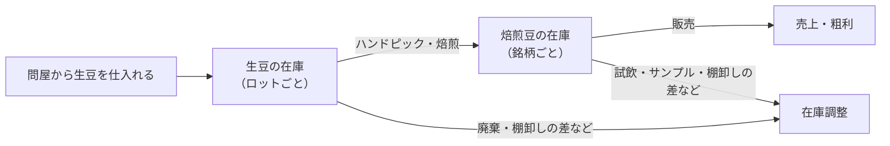
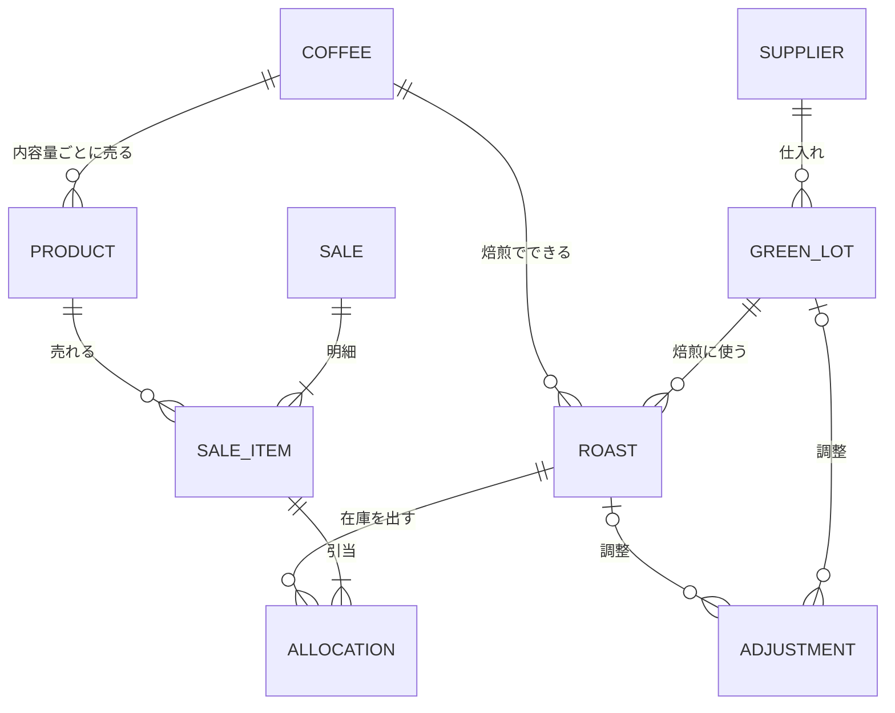

# コーヒー豆 在庫管理アプリ 仕様書

- 版：v0.5
- 更新日：2026-09-17
- 状態：確認事項への回答を反映した。技術構成は [アーキテクチャ提案](architecture.md) にまとめた。残りは「11. 要確認事項」で決める

## 1. 概要

### 1.1 目的

生豆の仕入れ・焙煎・販売を1つの Web アプリで記録し、次のことをできるようにする。

- 生豆と焙煎豆の在庫が、いつでも正しくわかる
- 仕入れ値をもとに、焙煎豆と商品の原価・粗利がわかる
- 焙煎の記録（プロファイル・焙煎後の特徴）を残し、次の焙煎に活かせる

### 1.2 使う人と使う場面

使う人は、焙煎・販売をしている本人だけ。店や自宅に加えて、イベント会場など外出先からも使う。

| 場面 | 主な端末 | すること |
|---|---|---|
| 生豆が届いたとき | PC | 仕入れを登録する |
| 焙煎した直後 | スマホ | 投入量・焙煎後重量・焙煎時間などを記録する |
| 数日後に試飲したとき | スマホ | 焙煎後の特徴を書き足す |
| 販売したとき（注文ごと、またはイベント後にまとめて） | PC・スマホ | 販売を記録する |
| 月末など | PC | 棚卸し、売上・粗利の確認 |

### 1.3 対象範囲

**やること**

- 生豆と焙煎豆の在庫管理（仕入れ・焙煎・販売・在庫調整による増減）
- 原価と粗利の計算
- 焙煎の記録（手回し焙煎機で測れる数値とメモ）

**今回やらないこと**

- ブレンド（シングルオリジンだけを扱う）
- ネットショップや POS との連携
- 顧客管理、請求書・納品書の発行、会計帳簿の作成
- 消費税の計算（金額はすべて税抜で扱う。要確認 #14）
- 温度ロガーによるプロファイル計測（フェーズ3で対応する予定。「10.2」参照）

## 2. 業務の流れとデータの関係

### 2.1 業務の流れ

1. 生豆を仕入れたら、1種類ごとに「生豆ロット」として登録する
2. 焙煎したら「焙煎記録」を作り、使った生豆ロットと、できあがった「銘柄」を選ぶ。生豆ロットの残量が減り、銘柄の在庫が増える
3. 販売したら「販売」を記録し、売れた「商品」（銘柄×内容量）と数量を入力する。銘柄の在庫が、焙煎日の古い焙煎記録から順に減る
4. 試飲・廃棄・棚卸しの差などは「在庫調整」で記録する

### 2.2 データの関係

| 図の名前 | 名前 | 意味 |
|---|---|---|
| SUPPLIER | 問屋 | 生豆の仕入れ先 |
| GREEN_LOT | 生豆ロット | 仕入れた生豆1種類分。同じ豆でも、仕入れた日が違えば別のロット |
| ROAST | 焙煎記録 | 1回（1バッチ）の焙煎 |
| COFFEE | 銘柄 | 販売する焙煎豆の種類。例：エチオピア イルガチェフェ 浅煎り |
| PRODUCT | 商品 | 銘柄×内容量。価格を持つ。例：エチオピア イルガチェフェ 浅煎り 200g |
| SALE / SALE_ITEM | 販売 / 販売明細 | 1回の販売と、その中の商品ごとの行 |
| ALLOCATION | 引当 | 販売明細の重さを、どの焙煎記録の在庫から出したか |
| ADJUSTMENT | 在庫調整 | 販売以外の増減（試飲・廃棄・棚卸しの差など） |

- 同じ生豆ロットから、焙煎度を変えて別の銘柄を作れる
- 生豆ロットが新しくなっても、同じ銘柄を使い続けられる

## 3. 機能一覧とフェーズ

フェーズ1＝最初に作って使い始める範囲、フェーズ2＝使いながら足す機能、フェーズ3＝温度ロガーができてから足す機能。

| 機能 | 内容 | フェーズ |
|---|---|---|
| ログイン | 本人だけがログインできる | 1 |
| 問屋 | 仕入れ先の登録 | 1 |
| 生豆ロット | 仕入れの登録。産地と問屋の情報、残量と kg 単価の表示 | 1 |
| 銘柄・商品 | 販売する豆と、内容量ごとの価格の登録 | 1 |
| 焙煎記録 | 重量・焙煎時間などの記録。ロス率と原価の計算 | 1 |
| 販売 | 販売の記録。在庫の引当と粗利の計算 | 1 |
| 在庫調整 | 試飲・廃棄・棚卸しなどによる増減の記録 | 1 |
| ホーム | 在庫と今月の売上の確認。よく使う記録へのボタン | 1 |
| 集計 | 月別・銘柄別の売上と粗利 | 1 |
| 焙煎タイマー | 焙煎中にスマホで「1ハゼ」「排出」などをタップして時間を記録 | 2 |
| 在庫アラート | 生豆の残りが少ないとき、焙煎から日数が経った豆があるときに知らせる | 2 |
| CSV の書き出し・取り込み | データの書き出しと、今までのデータの取り込み | 2 |
| 試飲の複数回記録 | 焙煎後の特徴を、日を変えて何回も記録する | 2 |
| 商品ページからの取り込み（候補） | 問屋の商品ページの URL を貼ると、産地などの項目を自動で入力する。問屋のサイトの利用規約を確認してから決める | 2 |
| 温度ロガー連携 | 温度ログの取り込み、焙煎カーブの表示と比較 | 3 |

## 4. 機能と項目

表の「必須」欄：○＝必須、空欄＝任意、計算＝自動で計算する（入力しない）。計算方法は「5. 計算ルール」を参照。金額はすべて税抜。

### 4.1 問屋

- 登録・編集できる。使わなくなった問屋は非表示にする
- 生豆ロットの登録画面からも追加できる

| 項目 | 必須 | 説明・例 |
|---|---|---|
| 問屋名 | ○ | 例：SPECIALTY COFFEE WATARU |
| 担当者 | | |
| 電話番号・メール | | |
| Web サイト | | |
| メモ | | 取引条件など |

### 4.2 生豆ロット（仕入れ）

- 仕入れた生豆を、1種類ごとに1つのロットとして登録する
- 問屋の商品ページ（例：SPECIALTY COFFEE WATARU）に載っている項目を、そのまま書き写せるようにする。商品ページはあとで見られなくなることがあるため、URL だけでなく内容も残す
- 同じ豆をまた仕入れたときは、前のロットをコピーして登録できる
- 1回の注文で複数の生豆を買ったときは、送料を各ロットに分けて入力する（要確認 #15）
- 一覧で、残量・kg 単価・仕入れ日を見られる。残量が 0 になったロットは「使い切り」になり、初期表示から外れる
- 詳細画面で、そのロットを使った焙煎記録と在庫調整の履歴を見られる
- 国・エリア・品種などの文字の項目は、過去に入力した値を候補に出す

| 区分 | 項目 | 必須 | 説明・例 |
|---|---|---|---|
| 基本 | ロット名 | ○ | 一覧や選択肢に出す短い名前。例：コロンビア ラ・エスペランサ 2026-09 |
| | 仕入れ日 | ○ | |
| | 問屋 | ○ | 登録済みの問屋から選ぶ |
| | 問屋の商品名 | | 例：コロンビア アルト・デル・オビスポ ラ・エスペランサ農園 |
| | 英文名 | | 例：Colombia Alto Del Obispo La Esperanza |
| | 商品コード | | 問屋の商品コード。再注文のときに使う |
| | 商品ページの URL | | |
| 産地 | 国 | ○ | 例：コロンビア |
| | エリア | | 例：ウイラ県サン・アグスティン、アルト・デル・オビスポ |
| | 農園名 | | 農園、ウォッシングステーションなど。例：ラ・エスペランサ農園 |
| | 生産者 | | 農園主や生産者団体の名前 |
| | 品種 | | 例：カトゥーラ、ゲイシャ |
| | 生産処理（精製方法） | | 選択肢から選ぶ。例：ウォッシュド、フリーウォッシュド、ナチュラル、ハニープロセス |
| | 標高 | | 例：1,780m、1,900〜2,100m（文字で入力） |
| | 収穫年度 | | 例：2025 |
| | 等級 | | 生産国の規格による等級。例：G1、SHB、AA |
| 問屋の情報 | ランク | | 問屋による格付け。選択肢から選ぶ。例：トップオブトップ、トップスペシャルティ、スペシャルティコーヒー、プレミアムコーヒー、コマーシャルコーヒー |
| | カッピングプロファイル | | 問屋による風味の評価。例：オレンジ、クランベリー、ブラックティー、ブライトアシディティ |
| | カッピングスコア | | 例：88.34 |
| | 認証・受賞 | | 複数選べる。例：有機JAS、フェアトレード、レインフォレスト・アライアンス、カップ・オブ・エクセレンス |
| | 包装 | | 問屋の表記のまま。例：24kg バキューム |
| | 商品説明・備考 | | 問屋の商品説明や備考欄を貼り付ける |
| 数量・金額 | 仕入れ重量 | ○ | kg で入力する（例：5、2.5） |
| | 仕入れ値 | ○ | 税抜・円 |
| | 送料などの経費 | | 税抜・円。原価に含める |
| | kg 単価 | 計算 | |
| | 残量 | 計算 | |
| その他 | メモ | | 保管場所など |

生産処理・ランク・認証・受賞の選択肢は、設定で変えられる（「4.9」）。

### 4.3 銘柄・商品

- 銘柄を登録し、その銘柄に商品（内容量と価格）を登録する
- 価格を変えても、過去の販売金額は変わらない（販売したときの単価を販売明細に残すため）
- 販売をやめた銘柄・商品は非表示にする
- 銘柄の一覧で、焙煎豆の残量と、商品の内容量で何個分あるかを見られる（例：残り 850g → 200g で4個分）
- 銘柄の詳細画面で、焙煎記録ごとの残量を見られる

**銘柄**

| 項目 | 必須 | 説明・例 |
|---|---|---|
| 銘柄名 | ○ | 例：エチオピア イルガチェフェ 浅煎り |
| 説明文 | | お客さん向けの紹介文 |
| 販売中 | ○ | オン／オフ |
| 焙煎豆の残量 | 計算 | |

**商品**

| 項目 | 必須 | 説明・例 |
|---|---|---|
| 銘柄 | ○ | |
| 内容量 | ○ | g。例：200 |
| 販売価格 | ○ | 税抜・円。例：1,700 |
| 包材費 | | 1個あたりの袋・ラベル代（税抜・円）。原価に含める |
| 販売中 | ○ | オン／オフ |

### 4.4 焙煎記録

- 1回（1バッチ）の焙煎ごとに記録する
- 保存すると、生豆ロットの残量が減り、銘柄の在庫が増える
- 焙煎の直後にスマホで入力しやすい画面にする。入力中は、同じ生豆ロットの前回の記録も表示し、比べながら入力できる
- 「焙煎後の特徴」は、試飲したあとで書き足せる
- 一覧で、焙煎日・銘柄・投入量→焙煎後重量・ロス率・焙煎時間・焙煎度を見られる。生豆ロットや銘柄で絞り込める

| 区分 | 項目 | 必須 | 説明・例 |
|---|---|---|---|
| 基本 | 焙煎日時 | ○ | 初期値は入力した日時 |
| | 生豆ロット | ○ | 残量のあるロットから選ぶ |
| | 銘柄 | ○ | 登録済みの銘柄から選ぶか、その場で作る |
| | 焙煎機 | | 初期値は「手回し焙煎機」。焙煎機を替えたときに比べるため |
| 重量 | 投入量 | ○ | g。焙煎機に入れた生豆の重さ |
| | ハンドピックで除いた量 | | g。初期値は 0 |
| | 焙煎後重量 | ○ | g |
| | ロス率 | 計算 | |
| プロファイル | 焙煎時間 | ○ | 投入から排出までの時間（分:秒） |
| | 1ハゼ開始 | | 投入からの時間（分:秒） |
| | 2ハゼ開始 | | 投入からの時間（分:秒） |
| | 1ハゼ後の時間・割合 | 計算 | |
| | 火力・操作のメモ | | 例：強火で始めて、1ハゼで弱火 |
| | 焙煎度 | | ライト／シナモン／ミディアム／ハイ／シティ／フルシティ／フレンチ／イタリアンから選ぶ |
| | メモ | | 気温・天気・反省点など |
| 焙煎後の特徴 | 特徴 | | 香りや味の特徴 |
| | 評価 | | 5段階 |
| | 試飲日 | | |
| 原価・在庫 | 原価 | 計算 | |
| | 1g あたり原価 | 計算 | |
| | 残量 | 計算 | |

### 4.5 販売

- 1回の販売に、複数の商品を入力できる。注文ごとでも、イベント1日分をまとめてでもよい
- 単価の初期値は商品の販売価格。卸や値引きで金額が違うときは書き換える
- 保存すると、銘柄の在庫が、焙煎日の古い焙煎記録から順に減る（先入れ先出し）。どの焙煎記録から出したかを「引当」として残し、原価と粗利を計算する
- 販売の詳細画面で、どの焙煎記録の豆が出たかを見られる
- 一覧で、販売日・販売チャネル・販売先・金額・粗利を見られる

**販売**

| 項目 | 必須 | 説明・例 |
|---|---|---|
| 販売日 | ○ | |
| 販売チャネル | ○ | 店頭／ネットショップ／イベント／卸／その他（設定で変えられる） |
| 販売先 | | 卸先の店名、イベント名など |
| メモ | | |
| 金額・原価・粗利 | 計算 | 明細の合計 |

**販売明細**

| 項目 | 必須 | 説明・例 |
|---|---|---|
| 商品 | ○ | 販売中の商品から選ぶ |
| 数量 | ○ | 個 |
| 単価 | ○ | 税抜・円。初期値は商品の販売価格 |
| 金額 | 計算 | 単価×数量 |
| 原価・粗利 | 計算 | |

### 4.6 在庫調整

- 販売以外で在庫が増えたり減ったりしたときに記録する。対象は生豆ロットか焙煎記録
- 焙煎豆の場合は、銘柄を選ぶと、残量のある焙煎記録を古い順に候補に出す
- 棚卸しでは、実際に量った残量を入力すると、差を自動で計算する
- 履歴は、対象の生豆ロット・焙煎記録の詳細画面で見られる

| 項目 | 必須 | 説明・例 |
|---|---|---|
| 日付 | ○ | |
| 対象 | ○ | 生豆ロット、または焙煎記録 |
| 増減量 | ○ | g。減ったときはマイナス |
| 理由 | ○ | 試飲・自家用／サンプル／廃棄／棚卸しの差／その他 |
| メモ | | |

### 4.7 ホーム

- 「焙煎を記録」「販売を記録」のボタン
- 焙煎豆の在庫：銘柄ごとの残量と、いちばん古い焙煎からの日数
- 生豆の在庫：ロットごとの残量
- 今月の売上と粗利

### 4.8 集計

- 月別：売上・原価・粗利・粗利率・販売した重さ
- 銘柄別（期間を指定）：販売した重さ・売上・粗利

### 4.9 設定

- 選択肢の編集：販売チャネル、生産処理、ランク、認証・受賞、在庫調整の理由

## 5. 計算ルール

| 名前 | 計算式 |
|---|---|
| 生豆の kg 単価 | （仕入れ値 ＋ 送料などの経費）÷ 仕入れ重量 |
| 生豆使用量 | 投入量 ＋ ハンドピックで除いた量 |
| 生豆ロットの残量 | 仕入れ重量 − 生豆使用量の合計 ＋ 在庫調整の合計 |
| ロス率 | （投入量 − 焙煎後重量）÷ 投入量 |
| 焙煎の原価 | 生豆使用量 × 生豆の g 単価 |
| 1g あたり原価 | 焙煎の原価 ÷ 焙煎後重量 |
| 焙煎記録の残量 | 焙煎後重量 − 引当の合計 ＋ 在庫調整の合計 |
| 銘柄の残量 | その銘柄の焙煎記録の残量の合計 |
| 1ハゼ後の時間 | 焙煎時間 − 1ハゼ開始 |
| 1ハゼ後の割合（DTR） | 1ハゼ後の時間 ÷ 焙煎時間 |
| 販売明細の原価 | 引当ごとの「重さ × その焙煎記録の 1g あたり原価」の合計 ＋ 包材費 × 数量 |
| 粗利 | 金額 − 原価 |
| 粗利率 | 粗利 ÷ 金額 |

- 金額はすべて税抜で計算する
- ハンドピックで除いた豆も代金を払っているので、原価には含める。ロス率には含めない
- 在庫調整で減らした分（試飲・廃棄など）の原価は、販売の原価に含めない
- 計算の途中では端数を丸めない。表示するときに、金額は円未満を四捨五入、率は小数第1位、g 単価は小数第2位までにする

**計算例**（金額は税抜）

1. 生豆 5kg を 9,000円、送料 1,000円で仕入れた → kg 単価 2,000円（g 単価 2円）
2. 投入量 500g、ハンドピックで 20g 除いた、焙煎後重量 425g → 生豆使用量 520g、ロス率 15.0%、原価 1,040円、1g あたり原価 2.45円
3. 焙煎時間 10:30、1ハゼ開始 8:30 → 1ハゼ後の時間 2:00、割合 19.0%
4. 200g・1,700円（包材費 50円）の商品を1個販売 → 原価 539円、粗利 1,161円、粗利率 68.3%
5. このときの残量：生豆ロット 5,000 − 520 ＝ 4,480g、焙煎記録 425 − 200 ＝ 225g

## 6. 入力チェックと業務ルール

| 場面 | ルール |
|---|---|
| 焙煎記録 | 生豆使用量が生豆ロットの残量より多いと、保存できない |
| 焙煎記録 | 焙煎後重量が投入量以上だと、保存できない。ロス率が 5〜30% の範囲外なら、入力ミスでないか確認を出す（そのまま保存もできる） |
| 焙煎記録 | 入力した時間が「1ハゼ開始 ＜ 2ハゼ開始 ＜ 焙煎時間」の順になっていないと、保存できない |
| 販売 | 銘柄の在庫が足りないと、保存できない（先に焙煎記録か在庫調整を入れる） |
| 販売 | 編集・削除すると、その販売の引当だけをやり直す。ほかの販売の引当は変えない |
| 在庫調整 | 残量がマイナスになる調整はできない |
| 編集全般 | すでに使った量より少なくなる修正はできない（例：200g 販売済みの焙煎記録の焙煎後重量を 150g にする） |
| 削除 | ほかの記録で使われているデータ（焙煎に使った生豆ロット、販売された商品など）は削除できない。代わりに非表示にする |

## 7. 画面一覧

すべての画面を PC とスマホの両方で使えるようにし、「主な端末」での使いやすさを優先する。

| # | 画面 | 主な内容 | 主な端末 |
|---|---|---|---|
| 1 | ログイン | | 共通 |
| 2 | ホーム | 在庫、今月の売上、記録ボタン | 共通 |
| 3 | 生豆ロット一覧 | 残量・kg 単価・仕入れ日、絞り込み | PC |
| 4 | 生豆ロット詳細 | 産地と問屋の情報、焙煎記録と在庫調整の履歴 | 共通 |
| 5 | 生豆ロット登録・編集 | 前のロットからのコピー | PC |
| 6 | 焙煎記録一覧 | 絞り込み | 共通 |
| 7 | 焙煎記録詳細 | 数値、焙煎後の特徴、原価、引当された販売 | 共通 |
| 8 | 焙煎記録登録・編集 | 同じロットの前回の記録も表示 | スマホ |
| 9 | 銘柄一覧 | 残量、何個分あるか | 共通 |
| 10 | 銘柄詳細・編集 | 商品（内容量・価格）の編集、焙煎記録ごとの残量 | PC |
| 11 | 販売一覧 | 絞り込み | PC |
| 12 | 販売詳細 | 明細、引当された焙煎記録 | 共通 |
| 13 | 販売登録・編集 | 明細の追加、在庫のチェック | 共通 |
| 14 | 在庫調整 | 調整の登録、棚卸しの入力 | 共通 |
| 15 | 集計 | 月別・銘柄別 | PC |
| 16 | 問屋一覧・編集 | | PC |
| 17 | 設定 | 選択肢の編集 | PC |

## 8. 非機能要件

| 区分 | 内容 |
|---|---|
| 端末・ブラウザ | PC とスマホの最新の Chrome・Safari。画面の幅に合わせて表示を変える |
| ログイン | メールアドレスとパスワードでログインする。使うのは本人だけなので、新規登録の画面と権限の区別は作らない。スマホで毎回ログインしなくてよいよう、ログインしたままにできる |
| データ量 | 生豆ロットは年に数十件、焙煎記録は年に数百〜千件ほどを想定する。特別な性能対策はしない |
| 数値の持ち方 | 重さは g、金額は円、時間は秒の整数で保存する。kg 単価・ロス率・原価などは保存せず、元の数値から毎回計算する（元の数値を直せば、すべてに反映される） |
| 金額 | 円のみ。すべて税抜で入力・保存・集計する。消費税は計算しない |
| 時刻 | 日本時間 |
| 同時操作 | 在庫を減らす処理（焙煎・販売・在庫調整）は、二重に送信したり、PC とスマホで同時に保存したりしても、残量が食い違わないようにする |
| 記録 | 各データに、作成日時と更新日時を残す |
| バックアップ | 1日1回以上データベースのバックアップを取り、アプリとは別の場所に保管する（方法は [アーキテクチャ提案](architecture.md) の「8」） |
| 通信 | HTTPS のみ |

## 9. 技術構成

サーバーは Python（Django）で作る。構成の詳細、理由、費用は [アーキテクチャ提案](architecture.md) にまとめた。

| 役割 | 使うもの |
|---|---|
| 画面とサーバーの処理 | Django（Python）。画面の HTML はサーバーで作り、一部を htmx で書き換える |
| データベース | PostgreSQL（Supabase の東京リージョン）。開発中は Free、本番は Pro にする |
| 公開先 | Fly.io の東京リージョン |

データベースと公開先は、SQLite にする案や、AWS に Terraform で構築する案とも比べて決めた（[アーキテクチャ提案](architecture.md) の「6」「11」）。

## 10. 将来の拡張

### 10.1 焙煎タイマー（フェーズ2）

手回し焙煎機で焙煎しながら、スマホで時間を記録する画面。

- 「投入」をタップするとタイマーが始まる。「1ハゼ」「2ハゼ」「火力変更」「排出」をタップすると、その時間を記録する
- 「排出」をタップすると、記録した時間が入った状態で焙煎記録の入力画面に進む
- 焙煎中はスマホの画面が消えないようにする
- タップした操作は「焙煎イベント」（時間・種類・メモ）として保存する。フェーズ3で温度カーブに重ねて表示するときにも使う

### 10.2 温度ロガー連携（フェーズ3）

熱電対ロガーで温度を測り、焙煎カーブを残す。

- 想定する構成：熱電対（K 型）＋変換モジュール（MAX31855 など）＋マイコン（ESP32 など）
- 取り込み方法の候補
  - A：焙煎記録ソフトの Artisan で記録し、書き出したファイルをアップロードする
  - B：マイコンから Wi-Fi でアプリに直接送る
- アプリでできること：温度カーブと温度の上がり方（RoR）の表示、1ハゼなどのイベントの重ね表示、過去の焙煎とのカーブ比較
- フェーズ1で気をつけること：焙煎記録に、あとから温度ログを紐づけられる形にしておく。フェーズ1のデータを作り直さずに足せるようにする

## 11. 要確認事項

決まった内容は本文に反映し、この表から消す。番号は振り直さない。

| # | 確認したいこと | 仮の案 |
|---|---|---|
| 14 | 店頭やネットショップで税込の金額を受け取ったとき、税込で入力すると税抜に直す機能（税率 8%）は必要か | なし。税抜に直してから入力する |
| 15 | 1回の注文で複数の生豆を買うことはあるか。その場合、注文ごとに送料を入れて、重さに応じて各ロットに自動で分けたいか | 送料はロットごとに入力する（まとめて買ったときは、自分で分けて入力する） |

## 12. 改訂履歴

| 版 | 日付 | 内容 |
|---|---|---|
| v0.1 | 2026-09-16 | たたき台 |
| v0.2 | 2026-09-16 | 要確認事項 #1〜#11 の回答を反映。使うのは本人だけにした。金額を税抜にした。生豆ロットの項目を問屋の商品ページに合わせた。#12 を公開先とデータベースに分け（#12・#13）、#14・#15 を追加した |
| v0.3 | 2026-09-17 | サーバーを Python（Django）にし、技術構成の詳細を architecture.md に分けた。外出先からも使うことを書き足した。#12・#13 を新しい構成に合わせて書き直した |
| v0.4 | 2026-09-17 | AWS に Terraform で構築する案（C）を、#12・#13 と「9. 技術構成」に加えた |
| v0.5 | 2026-09-17 | #12・#13 を決めた。データベースは Supabase の PostgreSQL、公開先は Fly.io で、どちらも東京リージョン |
